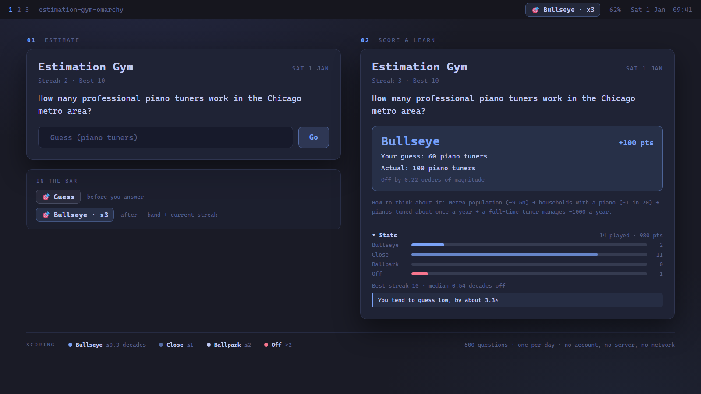

# Estimation Gym

A daily Fermi-estimation puzzle for the [Omarchy](https://omarchy.org) shell bar.

Every calendar day everyone sees the same question — a real-world quantity you
have to estimate ("how many piano tuners are there in Chicago?"), in the spirit
of the classic Fermi problem. You're scored on **order-of-magnitude closeness**,
not exact value, because getting within a factor of 10 of a hard question is a
genuinely useful skill and getting the exact number is not the point.

The bar chip shows today's status and your streak. Click it, type a number, and
the panel tells you how close you were in powers of ten — then reveals a
decomposition hint showing how to break the estimate down next time, plus where
the real figure comes from.

No account, no server, no network calls — the question bank ships with the
plugin and your history/streak live in a single local JSON file.

## Screenshot



## Why order-of-magnitude

Most useful estimation isn't about precision, it's about not being wrong by
1000×. Scoring in *decades* (powers of ten) rewards the skill that actually
transfers: decomposing an unknown quantity into things you roughly know, and
sanity-checking the size of the answer.

| Band | Distance from the true value | Meaning |
| --- | --- | --- |
| **Bullseye** | ≤ 0.3 decades | within ~2× |
| **Close** | ≤ 1 decade | within 10× |
| **Ballpark** | ≤ 2 decades | within 100× |
| **Off** | > 2 decades | more than 100× out |

Anything better than **Off** extends your streak; an **Off** resets it to zero.
Your best streak is kept alongside the current one.

## How the daily puzzle works

- The puzzle number is derived from the calendar date (day 0 = 2024-01-01 UTC),
  the same trick Wordle uses — so everyone on a given day gets the same question
  with no server involved.
- Questions are drawn from the bundled bank of **500** using a deterministic
  seeded shuffle. The whole bank is cycled through before anything repeats, and
  each pass reshuffles — so it's nearly a year and a half before you see a repeat.
- Questions whose answer changes over time carry a year, shown as "as of 2025"
  above the prompt, so answers don't silently go stale. That also makes the same
  quantity at different dates a genuinely different puzzle — world population in
  1800, 1900, 1950 and 2025 are four separate questions about growth rates.
- One puzzle per calendar day. Answering is idempotent — a shell restart can't
  double-count a day or inflate your streak.

## Install

```bash
omarchy plugin add https://github.com/SidathPeiris/estimation-gym-omarchy.git --enable
omarchy restart shell
```

This clones the repo into `~/.config/omarchy/plugins/sidath.estimation-gym`
and enables it. For local development, symlink your working copy instead so you
can edit in place:

```bash
ln -s "$(pwd)" ~/.config/omarchy/plugins/estimation-gym
omarchy plugin enable sidath.estimation-gym
```

The symlink saves you reinstalling, but it does **not** give you live reload —
the shell keeps running the code it started with. Restart it to pick up an edit:

```bash
omarchy restart shell
```

(That refuses to run while the session is locked, so unlock first.)

## Update

```bash
omarchy plugin update sidath.estimation-gym
omarchy restart shell
```

The restart is the part that matters. Updating only rewrites files on disk; the
running shell will keep serving the previous version until it reloads.

## Remove

```bash
omarchy plugin disable sidath.estimation-gym
omarchy plugin remove sidath.estimation-gym
omarchy restart shell
rm -rf ~/.local/state/estimation-gym   # optional: also clears your streak/history
```

## Usage

- The bar chip shows 🎯 **Guess** until you've answered; afterwards it shows the
  band you scored and your current streak (e.g. 🎯 **Bullseye · x7**).
- Click the chip to open today's puzzle. Type a numeric guess and press Enter
  (or click "Go"). Scientific notation like `3e12` works for big numbers.
- Stuck? **Hint** reveals how to approach that *shape* of problem — "stock
  equals flow times lifetime", "people times per-person rate" — without saying
  anything about the answer. It halves the day's points and leaves the day out
  of your calibration, but deliberately does **not** break your streak: the
  streak measures showing up, and charging someone for wanting to learn the
  method would be the wrong incentive.
- After answering, the panel shows your guess against the actual value, how many
  orders of magnitude off you were, the points earned, which archetype the
  question was, a hint for how to decompose the estimate next time, the source
  of the figure, and your current/best streak.
- Expand **Stats** for lifetime totals: band distribution, days played, best
  streak, median decades off, and — once you've played ten days — which way you
  lean, e.g. "You tend to guess low, by about 3.8×". Knowing your direction of
  error is the part you can actually correct.

## Also on your phone

The same puzzle runs as an installable web app:
**<https://sidathpeiris.github.io/estimation-gym-app/>**
([source](https://github.com/SidathPeiris/estimation-gym-app))

It vendors this repo's `Model.js` and `content/questions.js` verbatim, so both
show the same question on the same day and score it the same way. Install it to
your home screen and it plays offline.

Streaks are kept **independently** on each device. The app stores its history in
the browser rather than syncing, so this plugin keeps its no-account,
no-server, no-network guarantee — nothing here ever talks to the app.

## Develop / test

```bash
node Model.test.js          # scoring/streak/day-selection/calibration logic
node questions.test.js      # question bank schema, magnitudes, duplicate prompts
omarchy plugin validate .   # manifest schema check
qmllint -I /usr/share/omarchy/shell Widget.qml   # QML lint (best-effort; the qs.* shell modules aren't fully resolvable by plain qmllint)
```

`Model.js` is deliberately free of QML/Quickshell imports so the scoring, streak
and day-selection logic can be unit tested with plain `node`.

State lives at `~/.local/state/estimation-gym/state.json`. Delete it to reset
your streak/history.

## Project layout

```
manifest.json          # plugin id, kind (bar-widget), entry point
Widget.qml             # bar chip + popup panel UI
Model.js               # pure logic: day selection, scoring, streaks, stats, calibration
Model.test.js
questions.test.js      # question bank validation
preview.png            # marketplace listing preview
content/
└── questions.js       # the question bank
```

### Question format

```js
{
  "id": "internet-users-worldwide",   // kebab-case, unique
  "prompt": "How many people worldwide use the internet?",
  "asOf": 2025,                        // optional; omit for timeless quantities
  "unit": "people",
  "answerValue": 5400000000,           // positive; order of magnitude is what matters
  "decompositionHint": "World population ~8.1 billion with ...",
  "strategy": "population-rate",       // reasoning archetype; drives the Hint button
  "source": "ITU global connectivity statistics"
}
```

Every question also carries a `strategy`, one of fifteen reasoning archetypes,
 which selects the guidance shown by the Hint button. The archetype guidance
 lives in `Model.js` and is written once per shape of problem rather than once
 per question. See [CONTRIBUTING.md](CONTRIBUTING.md) for the full list.

Add `asOf` whenever the answer drifts (populations, prices, device counts) and
leave it off for fixed quantities — writing "as of 2025" on the number of atoms
in a human body would wrongly imply it moves. `node questions.test.js` enforces
the schema and flags near-duplicate prompts, ignoring pairs that differ only by
year.

## Dependencies

None beyond Omarchy/Quickshell itself (uses the shared `qs.Ui`/`qs.Commons`
shell components and `Quickshell.Io` for local file persistence). No network
access, no external services, no extra system packages.

## Status

Built for personal daily use; listed in the
[Omarchy plugin marketplace](https://plugins.omarchy.org/plugin.html?id=sidath.estimation-gym).

## License

MIT
